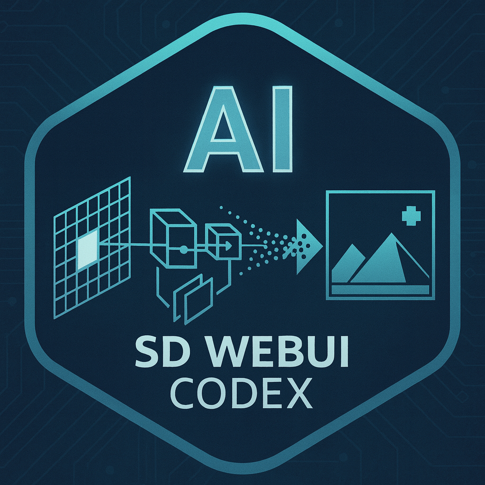

<p align="center">
  
</p>

<h1 align="center">Stable Diffusion WebUI Codex</h1>

<p align="center">
  FastAPI + Vue 3 WebUI for running multiple diffusion engines with explicit contracts (no silent fallbacks).
</p>

<p align="center">
  
  
  
  
  
  
  <a href="https://huggingface.co/sangoi-exe/sd-webui-codex"></a>
</p>

## ✨ What you get

- 🧠 Multi-engine: SD15, SDXL, FLUX.1, Chroma, Z-Image, and WAN 2.2 (video).
- 📡 Streaming jobs: request → `task_id` → SSE events → results.
- 🧾 Explicit contracts: missing/invalid inputs fail loud (no silent guessing).
- 🧰 Utility views: PNG Info, XYZ plot, GGUF tools, Workflows snapshots, Settings.

## 🚀 Quick start

Prereqs:
- Git
- Internet access for first install (downloads `uv`, CPython, Node.js, and wheels)
- No manual ffmpeg setup required: installer provisions repo-local `ffmpeg`/`ffprobe` and default RIFE model assets for video interpolation.

### Windows
```bat
install-webui.bat
run-webui.bat
update-webui.bat
```

### Linux / WSL
```bash
bash install-webui.sh
./run-webui.sh
bash update-webui.sh
```

When the WebUI starts, it prints the URLs:
```text
[webui] API: http://localhost:7850
[webui]  UI: http://localhost:7860
```
Open the UI URL in your browser. Stop with `Ctrl+C`.

More details (CUDA/ROCm selection, troubleshooting): see `INSTALL.md`.

### Safe updater behavior
- `update-webui.(bat|sh)` is fail-closed: it aborts on unsafe git state (detached HEAD, no upstream, ahead/diverged, merge/rebase/cherry-pick/bisect in progress, and tracked worktree changes).
- `--force` bypasses only the untracked-only dirty-tree blocker; tracked changes still abort even with `--force`.
- Abort output includes explicit causes and offending file/folder paths when local changes exist.
- Ignored paths (`.gitignore`) are excluded from the dirty-tree abort policy.
- Update path is non-destructive: `git fetch --prune` + `git pull --ff-only`; no `git clean`/`reset --hard`.
- `--force` does not delete files; it only allows updater preflight to continue when there are untracked files and no tracked changes.

## 📦 Models

Official Hugging Face repo: https://huggingface.co/sangoi-exe/sd-webui-codex

Available weights on the Hub (generated via `hf download --dry-run` on 2026-01-29):
- ⚡ FLUX.1
  - `flux/FLUX.1-dev-Q5_K_M-Codex.gguf`
- 🖼️ Z-Image
  - `zimage/Z-Image-Turbo-Q5_K_M-Codex.gguf`
  - `zimage/Z-Image-Turbo-Q8_0-Codex.gguf`
- 🎞️ WAN 2.2
  - `wan22/wan22_i2v_14b_HN_lx2v_4step-Q4_K_M-Codex.gguf`
  - `wan22/wan22_i2v_14b_LN_lx2v_4step-Q4_K_M-Codex.gguf`
  - `wan22-loras/wan22_i2v_14b_HN_lx2v_4step_lora_rank64_1022.safetensors`
  - `wan22-loras/wan22_i2v_14b_LN_lx2v_4step_lora_rank64_1022.safetensors`
  - `wan22-loras/wan22_t2v_14b_HN_lx2v_4step_lora_rank64_1017.safetensors`
  - `wan22-loras/wan22_t2v_14b_LN_lx2v_4step_lora_rank64_1017.safetensors`

Coming soon (supported by the WebUI, but not published on the Hub yet):
- ⏳ Chroma (Flux.1 Chroma packs)
- ⏳ Z-Image Base variant packs (Turbo is available today)
- ⏳ WAN 2.2 5B packs (GGUF)
- ⏳ WAN 2.2 Animate packs (GGUF)
- ⏳ More WAN 2.2 packs/variants

Refresh the list:
```bash
hf download --dry-run --quiet sangoi-exe/sd-webui-codex --include '*.gguf' --include '*.safetensors'
```

By default, models live under `models/`:
- `models/sd15/`, `models/sdxl/`, `models/flux/`, `models/zimage/`, `models/wan22/`
- plus `*-vae`, `*-tenc`, `*-loras`

Model hub notes and folder layout: see `README_HF_MODELS.md`.

If you customize model roots, edit `apps/paths.json`.

## 📄 License (noncommercial)

- Code license: PolyForm Noncommercial License 1.0.0 (`LICENSE`).
- Required notice must be preserved: `NOTICE`.
- Commercial use is not permitted: `COMMERCIAL.md`.
- Trademarks/branding: `TRADEMARKS.md`.

## 🙏 Credits

- Semantic baseline for “parity”: Hugging Face Diffusers.
- Inspiration: AUTOMATIC1111 + Forge (Codex backend/UI are reimplemented; no copy/paste ports).
