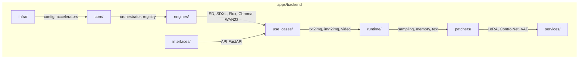

# Relatório de Auditoria do Projeto — stable-diffusion-webui-codex

**Data:** 2025-12-04  
**Autor:** Antigravity AI (auditoria automatizada)  
**Escopo:** Análise estrutural, inconsistências, redundâncias e recomendações de Design Patterns

---

## 1. Visão Geral do Projeto

O repositório **stable-diffusion-webui-codex** é uma reimplementação moderna da interface Stable Diffusion WebUI, migrando de Gradio para uma arquitetura Vue 3 + FastAPI com backend nativo em Python. A estrutura principal está organizada em:

```
├── apps/
│   ├── backend/       # Backend Python: engines, runtime, patchers, services
│   ├── interface/     # Frontend Vue 3 + Vite
│   ├── launcher/      # Launcher e profiles do processo
│   └── tui_bios.py    # TUI para BIOS/configuração
├── .sangoi/           # Documentação, planejamento, handoffs, changelogs
├── tools/             # Scripts de desenvolvimento e diagnóstico
└── tests/             # Testes automatizados
```

### Pontos Positivos

1. **Separação clara backend/frontend** — código bem modularizado
2. **Documentação AGENTS.md** — cada diretório importante tem seu `AGENTS.md`
3. **Lazy imports no `__init__.py`** — evita carregar torch/HF desnecessariamente
4. **Sistema de changelog e task-logs** — rastreabilidade de mudanças
5. **Ausência de imports legados** — nenhum `from modules` ou `import modules` no diretório `apps/`

---

## 2. Inconsistências Identificadas

### 2.1 Bare `except:` Clauses (Anti-Pattern)

> [!CAUTION]
> Há 2 ocorrências de `except:` sem tipo específico que podem mascarar erros importantes.

| Arquivo | Linha |
|---------|-------|
| `apps/backend/runtime/memory/stream.py` | 35, 57 |

**Código problemático:**
```python
except:
    return None
```

**Recomendação:** Substituir por `except Exception:` ou capturar exceções específicas como `RuntimeError`, `torch.cuda.CudaError`.

---

### 2.2 TODOs Pendentes (18 ocorrências)

Os TODOs indicam funcionalidades incompletas ou melhorias adiadas:

| Arquivo | Descrição |
|---------|-----------|
| `runtime/modules/k_prediction.py:293` | Opção de UI para binding latent size |
| `runtime/misc/sub_quadratic_attention.py:146,273` | Refatorar attention scores / alocação |
| `runtime/misc/checkpoint_pickle.py:12` | Safe unpickle |
| `gguf/gguf_reader.py:172` | Opção para erro em chaves duplicadas |
| `gguf/lazy.py:49,96,117,213` | Múltiplas melhorias de compreensividade |
| `gguf/metadata.py:56,239,268` | Carregar adapter_config.json / labels |
| `gguf/constants.py:1068,1171,1249` | Tipos GGML / 64-bit |
| `interfaces/api/run_api.py:787` | Preloading baseado em tab params |
| `infra/accelerators/trt.py:40` | Integrar TensorRT path |

---

### 2.3 Features Não Implementadas (32 `NotImplementedError`)

Recursos marcados como não portados ainda:

| Feature | Arquivo |
|---------|---------|
| Chroma ControlNet | `patchers/controlnet/architectures/chroma/__init__.py` |
| Flux ControlNet | `patchers/controlnet/architectures/flux/__init__.py` |
| ControlNet Lite | `patchers/controlnet/architectures/sd/control_lite.py` |
| Chroma Radiance detection | `runtime/model_registry/detectors/chroma.py` |
| Gradient checkpointing | `runtime/common/nn/unet/utils.py` |
| Vários samplers nativos | `runtime/sampling/driver.py` |
| Alguns tipos de LoRA | `patchers/lora.py:356` |

> [!NOTE]
> Isso é esperado em um projeto em migração — as `NotImplementedError` documentam gaps conhecidos.

---

### 2.4 Documentação Desatualizada

O arquivo `.sangoi/workspace-inventory.md` referencia caminhos legados que não existem mais:

```markdown
- `apps/server/` → não existe mais, foi consolidado em `apps/backend/`
- `backend/` → removido, shims eliminados conforme SHIM_INVENTORY.md
- `backend_ext/` → não encontrado na estrutura atual
```

**Recomendação:** Atualizar o `workspace-inventory.md` para refletir a estrutura atual.

---

## 3. Redundâncias Identificadas

### 3.1 Módulos de Compatibilidade

O diretório `apps/backend/runtime/modules/` contém 5 arquivos:

```
├── AGENTS.md
├── __init__.py
├── k_diffusion_extra.py
├── k_model.py
└── k_prediction.py
```

Estes são wrappers de compatibilidade que "shrink over time" conforme o `AGENTS.md` do `runtime/`. Avaliar se podem ser consolidados ou removidos.

### 3.2 Estrutura Duplicada de Modelos ControlNet

Há dois caminhos diferentes para modelos ControlNet:
- `apps/backend/patchers/controlnet/architectures/`
- `apps/backend/patchers/controlnet/models/`

Conforme `COMMON_MISTAKES.md:164`, o caminho correto é `architectures/`, mas a pasta `models/` ainda existe (ver `controlnet/models/chroma/__init__.py`).

---

## 4. Análise Estrutural

### 4.1 Arquitetura Backend



**Avaliação:** A estrutura segue bem os princípios de separação de responsabilidades com clara hierarquia entre:
- **Core** → Engine interface + orchestration
- **Engines** → Implementações por modelo
- **Runtime** → Componentes reutilizáveis
- **Use Cases** → Orquestração de tasks
- **Services** → Serviços de alto nível para API

### 4.2 Arquitetura Frontend

```
apps/interface/src/
├── api/          # Cliente API
├── components/   # 33 componentes reutilizáveis
├── views/        # 18 views (páginas)
├── stores/       # 14 stores Pinia
├── styles/       # 15 arquivos de estilo
└── utils/        # Helpers
```

**Avaliação:** Estrutura standard Vue 3 bem organizada.

---

## 5. Design Patterns Recomendados

### 5.1 Padrões Existentes (Manter)

| Pattern | Onde é Usado | Avaliação |
|---------|--------------|-----------|
| **Registry Pattern** | `core/registry.py`, `model_registry/` | ✅ Excelente |
| **Lazy Loading** | `backend/__init__.py` `__getattr__` | ✅ Excelente |
| **Factory Pattern** | `engines/registration.py` | ✅ Adequado |
| **Strategy Pattern** | Sampling drivers, attention backends | ✅ Adequado |
| **Dataclass/Enum First** | `CODESTYLE.md` directive | ✅ Enforced |

### 5.2 Padrões Recomendados (Implementar)

#### 5.2.1 Result Pattern para Erros

Em vez de exceções dispersas, usar um `Result` type:

```python
from dataclasses import dataclass
from typing import TypeVar, Generic

T = TypeVar('T')

@dataclass
class Result(Generic[T]):
    value: T | None = None
    error: str | None = None
    
    @property
    def is_ok(self) -> bool:
        return self.error is None
    
    @classmethod
    def ok(cls, value: T) -> 'Result[T]':
        return cls(value=value)
    
    @classmethod
    def err(cls, error: str) -> 'Result[T]':
        return cls(error=error)
```

#### 5.2.2 Pipeline Pattern para Processamento

Os use cases (`txt2img`, `img2img`) podem se beneficiar de um pipeline explícito:

```python
from dataclasses import dataclass
from typing import Callable, List

@dataclass
class PipelineStage:
    name: str
    execute: Callable[[dict], dict]

class Pipeline:
    def __init__(self, stages: List[PipelineStage]):
        self.stages = stages
    
    def run(self, context: dict) -> dict:
        for stage in self.stages:
            logger.debug(f"Pipeline: entering {stage.name}")
            context = stage.execute(context)
        return context
```

#### 5.2.3 Event Bus para Comunicação Cross-Component

Reduzir acoplamento entre engines e UI:

```python
from dataclasses import dataclass
from typing import Callable, Dict, List
from enum import Enum

class EventType(Enum):
    GENERATION_STARTED = "generation_started"
    STEP_COMPLETED = "step_completed"
    GENERATION_COMPLETED = "generation_completed"

@dataclass
class Event:
    type: EventType
    payload: dict

class EventBus:
    _subscribers: Dict[EventType, List[Callable]] = {}
    
    @classmethod
    def subscribe(cls, event_type: EventType, handler: Callable):
        cls._subscribers.setdefault(event_type, []).append(handler)
    
    @classmethod
    def publish(cls, event: Event):
        for handler in cls._subscribers.get(event.type, []):
            handler(event)
```

---

## 6. Guia de Design para Desenvolvimento Futuro

### 6.1 Princípios Core (do CODESTYLE.md)

1. **Codex-first design** — Rebuild com dataclasses/enums, sem globals opacos
2. **Modularidade** — Código específico de arquitetura em packages dedicados
3. **Erros explícitos** — Nunca silent fallbacks, mensagens acionáveis
4. **Telemetria** — Log structured, validate tensors em entry points
5. **Dependency hygiene** — Ban imports legados, guard optional deps

### 6.2 Checklist para Novas Features

```markdown
- [ ] Criar/atualizar `AGENTS.md` no diretório relevante
- [ ] Usar dataclasses para config, enums para modos
- [ ] Lazy-load dependencies pesadas (torch, transformers)
- [ ] Log com module logger, não `print()`
- [ ] Exceções com mensagens acionáveis (causa + remediação)
- [ ] Testes em `tests/` correspondente
- [ ] Atualizar `.sangoi/CHANGELOG.md`
- [ ] Atualizar task-log em `.sangoi/task-logs/`
```

### 6.3 Convenções de Nomenclatura

| Tipo | Convenção | Exemplo |
|------|-----------|---------|
| Classes | PascalCase | `ControlNetConfig` |
| Funções | snake_case | `load_model_state` |
| Constantes | UPPER_SNAKE | `DEFAULT_BATCH_SIZE` |
| Módulos | snake_case | `model_registry.py` |
| Enums | PascalCase + UPPER members | `class SamplerKind(Enum): EULER = "euler"` |

### 6.4 Estrutura de Diretórios para Novos Componentes

```
apps/backend/<component>/
├── AGENTS.md           # Obrigatório: propósito, owner, status
├── __init__.py         # Exports públicos (lazy quando possível)
├── config.py           # Dataclasses de configuração
├── types.py            # Enums, TypedDicts
├── <feature>.py        # Implementação principal
└── tests/              # (ou em tests/<component>/)
```

---

## 7. Ações Recomendadas

### 7.1 Alta Prioridade

| # | Ação | Esforço | Impacto |
|---|------|---------|---------|
| 1 | Corrigir `except:` bare em `stream.py` | Baixo | Alto (debugging) |
| 2 | Atualizar `workspace-inventory.md` | Baixo | Médio (docs) |
| 3 | Consolidar paths ControlNet (`models/` → `architectures/`) | Médio | Médio (clareza) |

### 7.2 Média Prioridade

| # | Ação | Esforço | Impacto |
|---|------|---------|---------|
| 4 | Resolver TODOs críticos (safe unpickle, TensorRT) | Alto | Alto |
| 5 | Avaliar remoção de `runtime/modules/` compat layer | Médio | Médio |
| 6 | Implementar Result Pattern para erros cross-module | Médio | Alto |

### 7.3 Backlog

| # | Ação | Esforço | Impacto |
|---|------|---------|---------|
| 7 | Portar ControlNet Flux/Chroma | Alto | Alto (features) |
| 8 | Implementar gradient checkpointing | Alto | Médio (VRAM) |
| 9 | Adicionar Event Bus para progress tracking | Médio | Médio |

---

## 8. Conclusão

O projeto **stable-diffusion-webui-codex** está em **boa saúde estrutural**:

- ✅ Separação clara de responsabilidades
- ✅ Documentação consistente com AGENTS.md
- ✅ Imports legados eliminados do código ativo
- ✅ Lazy loading implementado corretamente

**Áreas de atenção:**
- ⚠️ Bare exceptions em código crítico de stream
- ⚠️ Documentação workspace desatualizada
- ⚠️ 32 features ainda não portadas (documentado via NotImplementedError)

**Maturidade estimada:** 75-80% da migração completa, com gaps conhecidos e bem documentados.

---

> [!TIP]
> Para manter a qualidade do código, rodar periodicamente:
> ```bash
> rg "except:" apps --include "*.py" | grep -v "except [A-Z]"
> rg "TODO|FIXME" apps --include "*.py" | wc -l
> find apps -name "AGENTS.md" -exec grep -l "Last Review" {} \;
> ```
